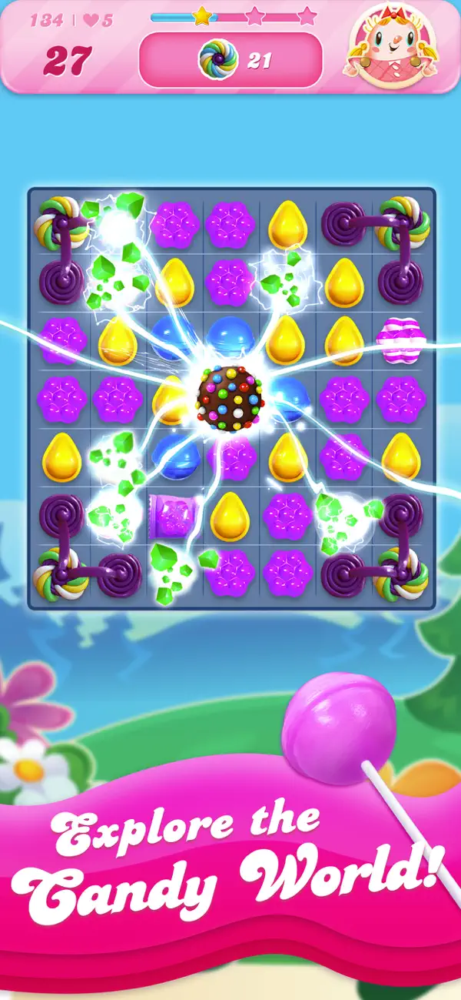
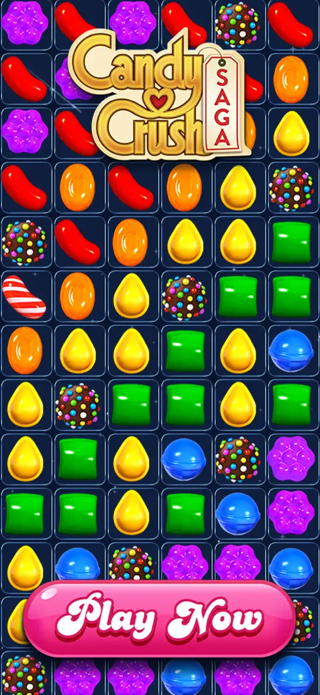
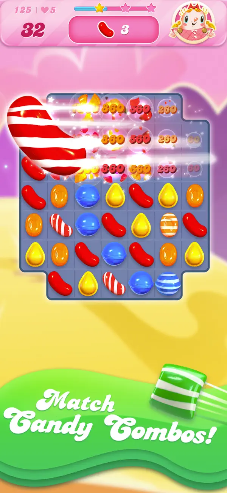
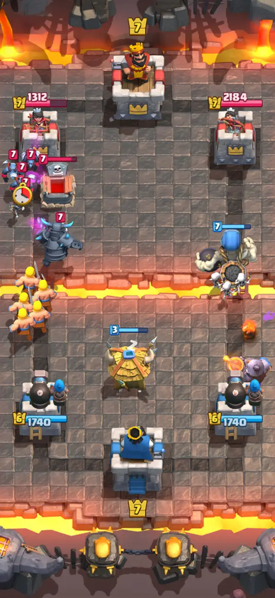
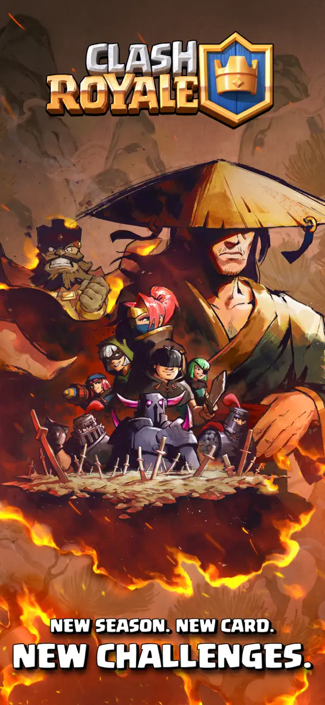
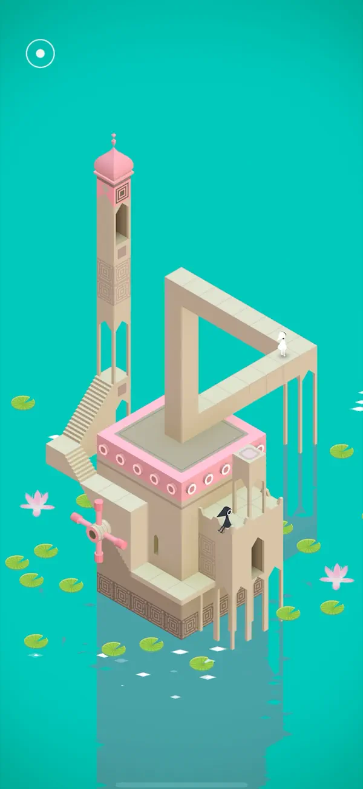
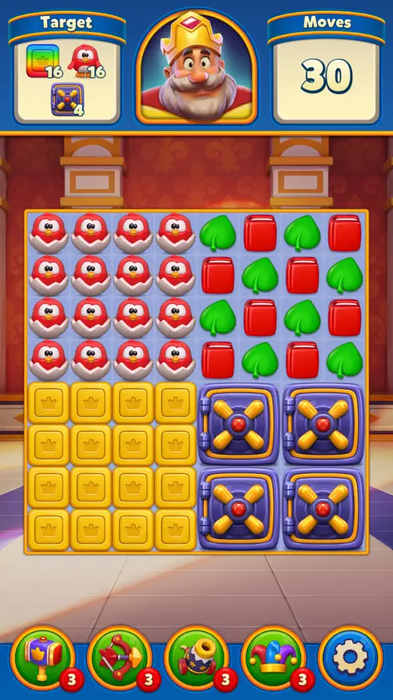
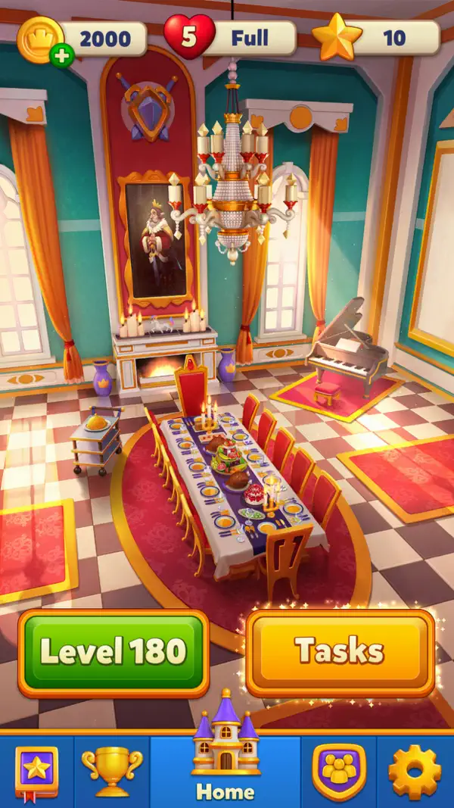

# Visual reference index

These App Store screenshots are stored for internal design research. The publishers own the artwork and marks. Do not ship them in the game or use them as production assets.

## Objective, moves, and board hierarchy

What to study: the remaining moves, objective count, and progress meter stay in one compact band. The active board remains the largest object. The effect is spectacular, but its origin is still visible.

## Core board hierarchy

What to study: a giant "Play Now" call to action and logo can overpower the board in marketing art. That is useful for acquisition creative, but it is the wrong hierarchy for active play. In-game UI should keep the board and current decision first.

## Progress framing

What to study: combo motion, score values, and the remaining board state are visible at once. The repeated score labels are readable here, though an actual match should avoid leaving that much text over the board for long.

## Battle HUD density (Clash Royale)

What to study: a real-time HUD must fit tower health, elixir, and the card hand around a play area the player watches constantly. The hand sits at the bottom where thumbs reach, while tower HP reads as small glanceable numbers near the towers. It is dense, but every element has a place and a purpose; nothing waits for a second screen.

## Seasonal event framing (Clash Royale)

What to study: a season bundles a release window, a new card, and new challenges into one message. That is the live-ops pitch: a single recurring beat that gives players a reason to return. This frame is marketing art, not in-game UI. The lesson for in-game UI is to keep the season's hook legible without shipping a billboard into the play screen.

## Minimal scene (Monument Valley)

What to study: nearly the whole frame is the puzzle. There is no HUD text, no score, no health - the geometry and the path are the interface. This is the far end of the "board first" hierarchy: when the challenge is clear, the UI can almost disappear. Respect safe areas and let empty space carry meaning.

## Level objective framing (Royal Match)

What to study: before play, the objective and the move budget sit on one compact card. The player reads the goal, sees the move count, then starts. The game should copy this: state the objective up front, keep the card small, and do not let the intro screen cover the board for long.

## Home and task hub (Royal Match)

What to study: the home hub groups the next level, a task list, and currency and energy into one vertical column. It works as a live-ops landing page: the player can scan what to do next without navigating. Energy and currency read at the top while the next actionable level stays prominent.

## Provenance

Captured from the current US Apple App Store product pages. The Candy Crush screenshots were captured on 2026-07-23; the Clash Royale, Royal Match, and Monument Valley screenshots were captured on 2026-08-09.

Candy Crush Saga:
- `candy-crush-objective-board.webp`: App Store asset ID `7cd3c0cbbc404cd7`
- `candy-crush-core-board.webp`: App Store asset ID `caffc76cc0c5fa85`
- `candy-crush-progression.webp`: App Store asset ID `9433ecaabfd64859`

Clash Royale (Supercell), `CR_enUS_RoninSet_ActionV1` set:
- `clash-royale-battle-hud.webp`: asset token `PurpleSource211/v4/65/9a/3e/659a3efb-170e-a792-1311-9364535c5d51/CR_enUS_RoninSet_ActionV1_SS3_iOS_6.5_1242x2688_Phiture.jpg`
- `clash-royale-season-event.webp`: asset token `PurpleSource211/v4/27/9a/8f/279a8f72-7ddc-632c-8107-57a1c2538439/CR_enUS_RoninSet_ActionV1_SS1_iOS_6.5_1242x2688_Phiture.jpg`

Royal Match (Dream Games):
- `royal-match-level-intro.webp`: asset token `Purple211/v4/e1/3a/77/e13a77a8-7f4b-e90d-1462-2fb97781227f/7e33d9b3-9323-40f8-a631-60d44884338f_bird.jpg`
- `royal-match-map-tasks.webp`: asset token `Purple211/v4/06/8b/2a/068b2a83-9836-32fd-582c-be7b71e92c42/8a9faf28-7d4a-4fda-b041-58bb23805549_dining_room.jpg`

Monument Valley (ustwo):
- `monument-valley-minimal-scene.webp`: asset token `PurpleSource124/v4/79/90/c0/7990c0f1-58e8-88aa-f6ea-5d698c11f501/0e791305-2887-49f7-8737-9051592d37b0_iPhone_X_Screenshot_-_1.png`

Source pages:
- <https://apps.apple.com/us/app/candy-crush-saga/id553834731>
- <https://apps.apple.com/us/app/clash-royale/id1053012308>
- <https://apps.apple.com/us/app/royal-match/id1482155847>
- <https://apps.apple.com/us/app/monument-valley/id728293409>
